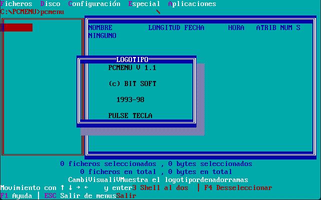
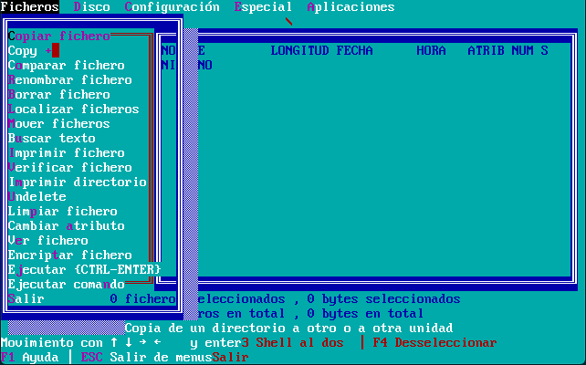
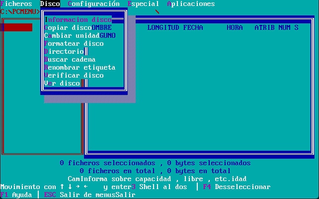
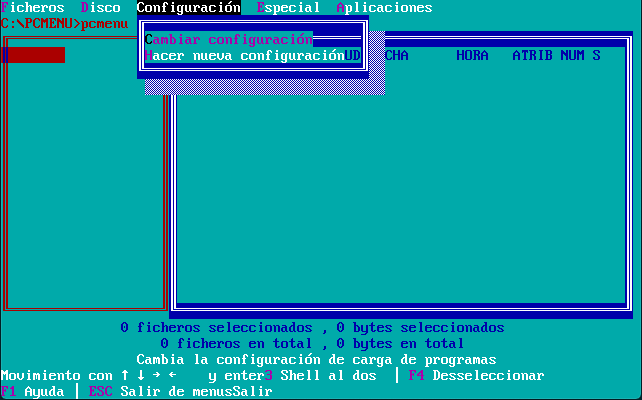
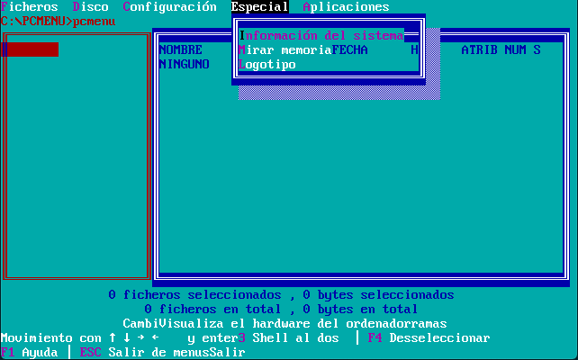
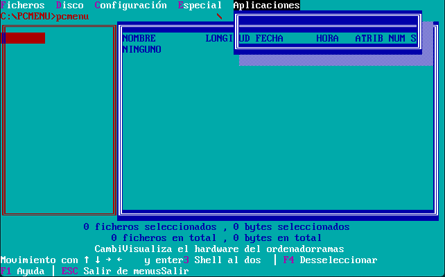
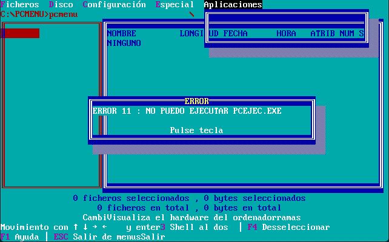

Esta es una versión corregida de PCMENU, pues la original no compilaba tan siquiera.
El código se ha conseguido compilar satisfactoriamente usando Borland C++ 3.0 en MS-DOS desde emulador Dosbox v0.74-3-3 bajo Mac OS X 10.15.7.

Sin embargo, no parece ser una versión finalizada pues la mayoría de opciones del menú no ejecutan ninguna acción.

Correcciones realizadas:

- Errores de sintaxis: falta ; en sentencia export en PCESCRIB.H

- Control de división por cero en PCDISCO.C en funcion cogerinfodisco

- El código parece estar en proceso de separarse de PCVENTAN.C y PCESCRIB.C. PCVENTAN.C no estaba incluido en el archivo de proyecto, pero parece ser quien tiene las funciones mas completas, por tanto se reincluye y se renombran algunas funciones y simbolos repetidos de PCESCRIB.C agregando prefijo old_

- Agregar algunos simbolos extern en PCESCRIB.H y PCVENTAN.H

- Algunas funciones en assembler como writemargen de PCESCRIB.C no compilan, dan errores de sintaxis u operadores no soportados. Se convierten a código C

- Función fillwin de PCVENTAN.C provoca cuelgues en el PC; parece que no le sienta nada bien escribir directamente a memoria de pantalla. Se desactiva dicho código. Es por eso que el menu no borra el "rastro" de texto anterior y tambien parece que hay sitios donde no aparece texto. Sucede lo mismo con la función writestr de mismo archivo. No costaria mucho usar código C para escribir en pantalla mediante las funciones conio (si no recuerdo mal, era conio)

- Desactivada la finalización con error desde función ponerror de PCUTIL.C: parece que al iniciar PCMENU da algún error y volvía siempre al prompt de msdos sin abrir el programa. Quizá es alguna incompatibilidad con las unidades de disco y/o con DosBox

- En PCUTIL.C, funcion siconfirmacion: el compilador de C generaba código assembler erroneo: un opcode "mov ax" asi tal cual, sin operando. Jugando a mover trozos de código dentro de esa función se corrigió (el array de tecsalir[] lo moví fuera de la función)

Algunas capturas:

