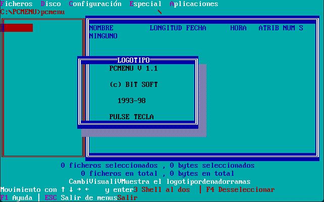
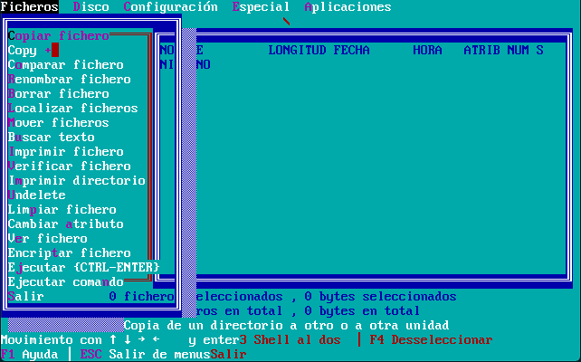
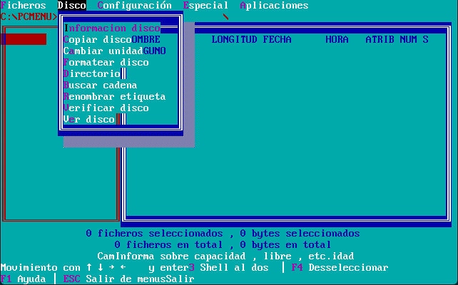
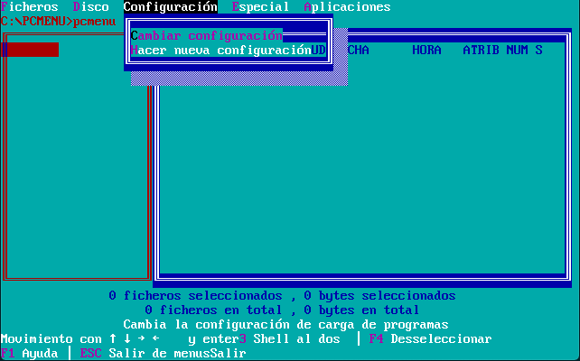
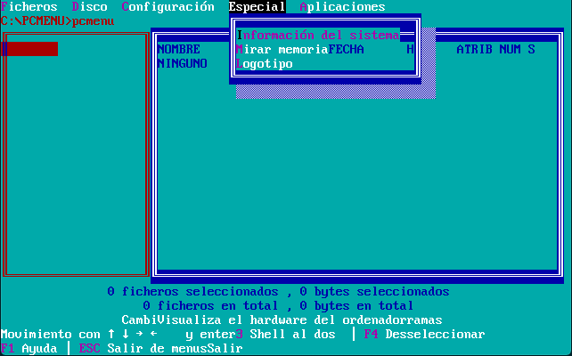
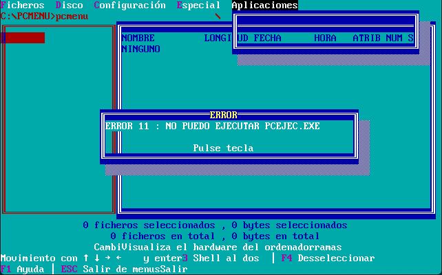

Esta es una versión corregida de PCMENU, pues la original no compilaba tan siquiera.
El código se ha conseguido compilar satisfactoriamente usando Borland C++ 3.0 en MS-DOS.

Algunas capturas:

Cosas a considerar:
....
