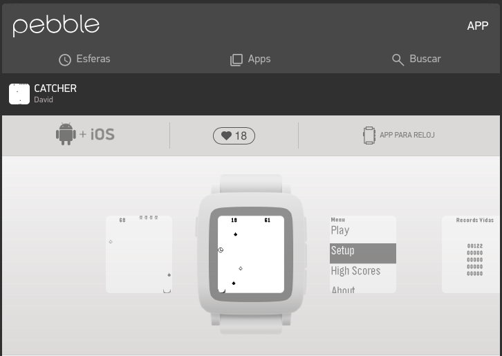
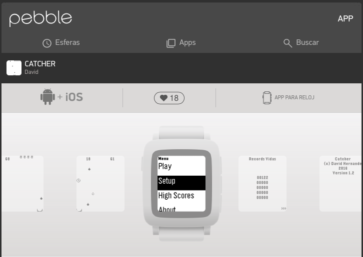
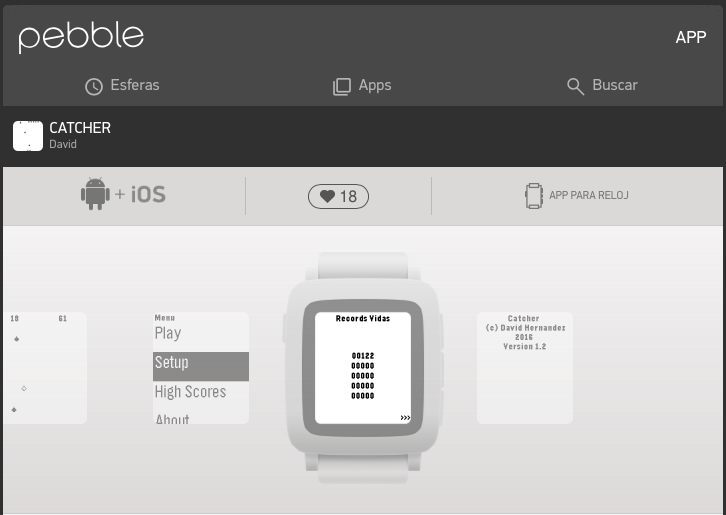
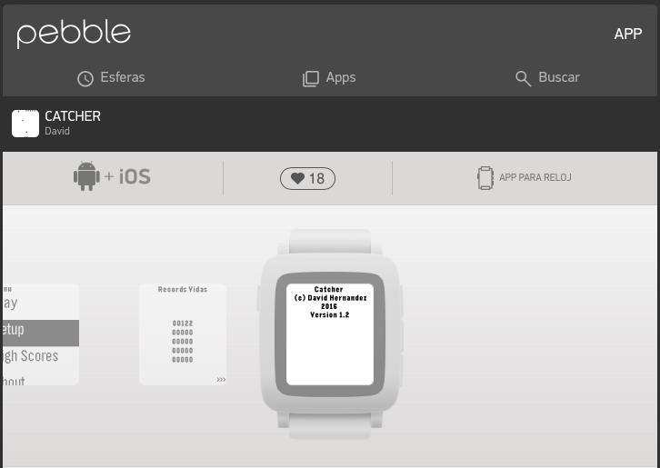

Catcher
https://apps.rebble.io/es_ES/application/5668333f53fae73a07000039?query=catcher&section=watchapps

 It's a simple catcher game.
 You have 2 modes of play : time mode and lives mode.
 In time mode you will play until time goes to 0.
 In lives mode you will play until no lives left.
 You have to catch tears (black and white).
 In time mode you can catch a clock for adding time.
 Black tear add two points to score, white add four points.
 Added animation of objects crashed.
 In lives mode there are five lives and for the moment there weren't added none while playing.
 It saves the 5 hightest score to pebble for every mode : 5 for lives mode and another 5 for time mode. 
 Menu and messages are shown in 4 configurable languages : spanish , english , tagalog and waray.
 Waray language already not yet, waray for the moment is the same as english.
 Tagalog language with the help of google translate, not revised.
 Default language is spanish.

Last version published on Pebble/Rebble store: 1.3 on 21 September 2016 13:31:26 GMT
Last source code version 1.5 on 10 July 2018 (seems not to be published on the store)

Some screenshots:

